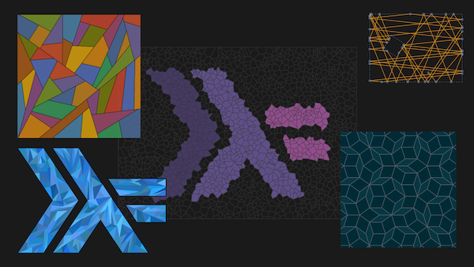

In this tutorial, we're going to dive into the world of 2D geometry,
recursive patterns and randomness to generate art from Haskell code.

Using a beginner-friendly geometry library, we'll build up more and
more interesting 2D images that are generated algorithmically or even
interactively.

We've prepared a few examples like Voronoi patterns, Penrose tiling,
and bouncing rays. This is a guided tour, so feel free to lean back
and enjoy, but there will be plenty of time to code along and bring
your own ideas to the Canvas!

Prerequisites: You should have beginner knowledge of Haskell, being
somewhat fluent with simple types, pattern matching, function
application and composition, basic `IO` and `do`-notation. ["Learn you
a haskell"](http://learnyouahaskell.com/)-level should be sufficient.

To prepare for the workshop, you should have a working `stack` setup.
To install `stack`, follow the instructions on
<a href="https://docs.haskellstack.org/en/stable/README/">docs.haskellstack.org</a>. To make sure
everything is working, clone
<a href="https://github.com/quchen/generative-art">github.com/quchen/generative-art</a>,
and run `stack build --haddock`. This will take some time the first time you run
it for compiling all the dependencies, so we recommend doing it once
before the workshop!

### David Luposchainsky (quchen)

[@quch3n](https://twitter.com/quch3n)

David has been a Haskell enthusiast ever since he (was) stumbled upon
it in early 2012 as a physics student. After spending a lot of time
with it and talking to others in #haskell, he proposed the unifying
the Applicative-Monad hierarchy and removing the fail function from
the Monad class to the mailing lists. The former is live as of GHC
7.8, the latter is in a backwards-compatible slow transitional phase
for the next couple of compiler versions. As of 2016, he is member of
the Core Language committee to work on the next Haskell standard.

When David isn't working or haskelling, he spends his time outdoors
hiking, bouldering, mountainbiking or motorcycling.

### Franz Thoma

Franz Thoma is originally a physicist and works as a consultant and
software engineer at TNG Technology Consulting in Munich. While
spending time there on domain specific languages and building
compilers, he discovered his love for functional languages and
expressive type systems. With Haskell, Franz found a robust and
elegant language to express himself, which he uses for his own
personal tooling as well as a thinking tool.

